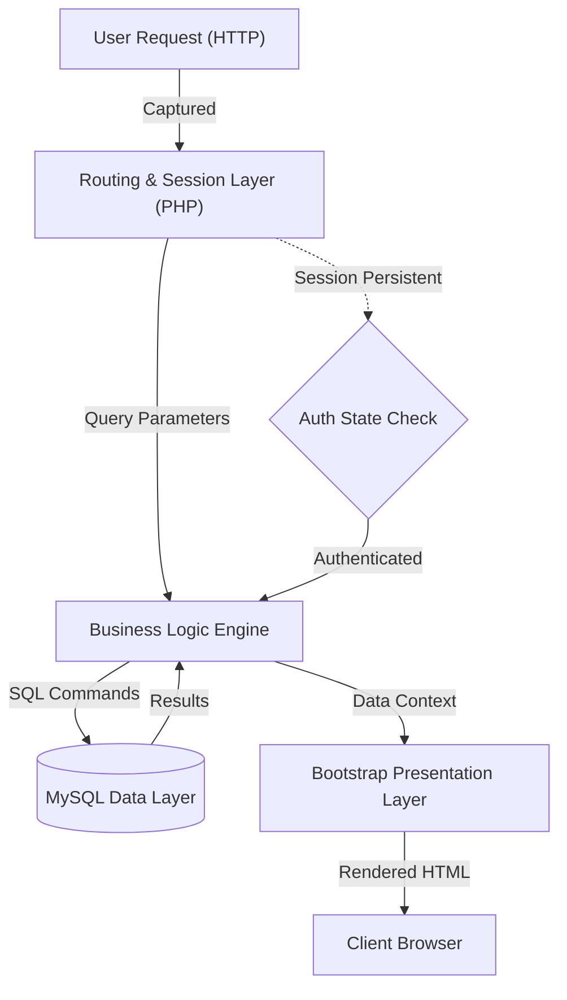

# Technical Specification: DIGITAL-BOOKSTORE

## Architectural Overview
The **DIGITAL-BOOKSTORE** is a professional full-stack e-commerce application implemented using the **LAMP stack** (Linux, Apache, MySQL, PHP). The architecture follows a multi-tier model where the presentation layer is decoupled from the business logic and persistent data storage.

### Architectural Flow

## 1. Program Structure
The application logic is distributed across modular PHP scripts that manage specific lifecycle events of the user journey.

### Core Components:
- **Data Connectivity Layer (`dbconnect.php`)**: Establishes a persistent connection to the MySQL database using the `mysqli` extension and manages exception handling for connection failures.
- **Authentication Subsystem (`login.php`, `register.php`)**: Implements session-based user identification, handling credential verification and registration persistence.
- **Inventory Engine (`Product.php`, `Author.php`, `Result.php`)**: Dynamically constructs SQL queries based on user filtering (Category/Author) or search keywords and utilizes PHP to render product objects.
- **Cart Management Layer (`cart.php`)**: A stateful engine that synchronizes user-selected products with database records, calculating metrics like MRP, Discount, and Net Total.

## 2. Session Logic & Application States
The application operates through a set of transactional states determined by user activity and `$_SESSION` variables.

| State | Trigger | Output/Action |
|-------|---------|---------------|
| **Anonymous Browse** | Initial Access | Home page display with Login/Signup availability. |
| **Authentication** | Login/Registration Event | Creation of `$_SESSION['user']` and redirection to secure context. |
| **Catalog Exploration** | Category/Search Select | Dynamic execution of `SELECT` queries with filtering/sorting. |
| **Cart Mutation** | "Add to Cart" Action | `INSERT` or `UPDATE` operation on the persistent `cart` table. |
| **Order Confirmation** | Cart Submission | Final calculation of order value and order record instantiation. |

## 3. Cart Synchronization Specification
The cart logic employs a "Sync-on-Demand" algorithm within the `cart.php` module.

### Persistence Logic:
1. **Entry Check**: On adding a product, the system performs a `count` check on the `cart` table for the specific `{User, Product}` tuple.
2. **Dynamic Update**: 
   - If tuple exists: Executes an `UPDATE` command to synchronize the new quantity.
   - If tuple is missing: Executes an `INSERT` command to instantiate the cart record.
3. **Calculated Fields**: Discounts and totals are calculated server-side to ensure financial integrity before rendering the final view.

## 4. Input Handling & Interface
The program employs a hybrid interaction model:
- **Server-Side Rendering (PHP)**: Generates the core HTML structure based on database state.
- **Client-Side Dynamics (jQuery)**: Facilitates interactive elements such as quantity selectors on the `description.php` page and real-time form validations.
- **Responsive Grid (Bootstrap)**: Ensures the interface adapts to various viewport geometries.

## 5. Data Schema
The relational data model is comprised of three primary entities:
- **`users`**: Stores unique character-based usernames and passwords for credential matching.
- **`products`**: A comprehensive metadata repository for books (PID, Title, Author, Price, Category).
- **`cart`**: A junction table mapping `Customer` identifiers to `Product` identifiers with associated `Quantity` metrics.

---
*Technical Specification | Computer Engineering Project | Version 1.0*
